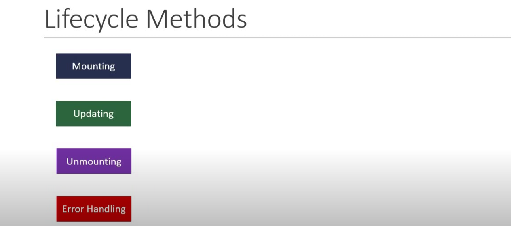

# LifeCycle Methods

## Mounting
When an instant of component is being created and inserted into DOM.

- constructor
- static getDerivedStateFromProps
- render
- componentDidMount

## Updating
When a Component is being re-rendered as a result of change in its props and state.

- static getDerivedStateFromProps
- shouldComponentUpdate
- render
- getSnapshotBeforeUpdate
- componentDidUpdate

## Unmounting
When a Component is being removed from the DOM

- static getDerivedStateFromProps

## Error Handling
When there is an error during rendering in a lifecycle method , or in constructor of a childComponent.

- static getDerivedStateFromProps