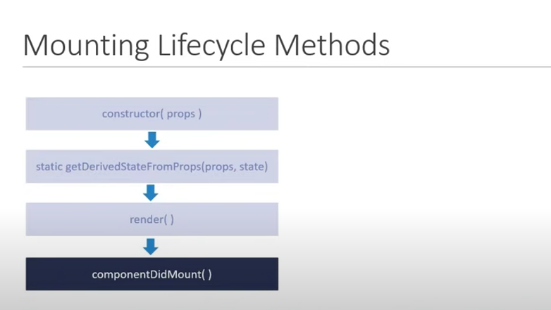
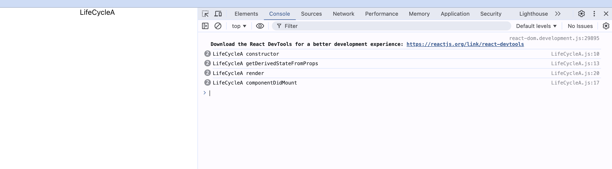

# Mounting LifeCycle Methods

## Constructor(props)
- A special function that is called whenever a `new component` is created.
- initializing State, Binding the event handlers.
- Do not cause side effects: Ex HTTP requests.
- First we have to call `super()` only when we have done that we will have access to `this.state()`

## static getDerivedStateFromProps (props,state)
- When the state of the component depends on changes in props over time .
- set the state.
- Do not cause side effects. EX :HTTP Requests

## render()
- only required method.
- read props and state and return jsx.
- Do not change state interact withDOM or make ajax calls.

## componentDidMount()
- invoked immediately after a component and all its children component have been rendered to the DOM.
- cause side effects. Ex interact with the DOM or perform ajax calls to load data.

