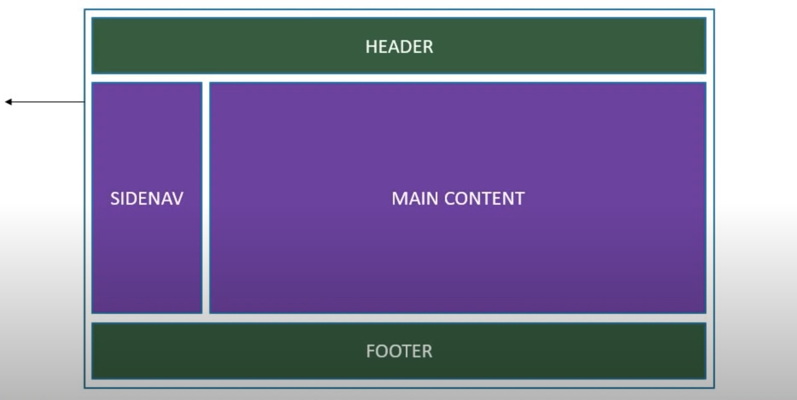
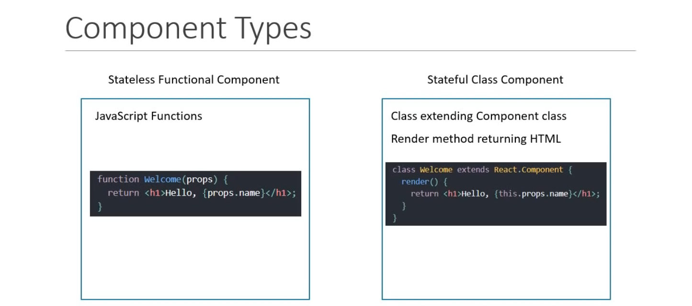
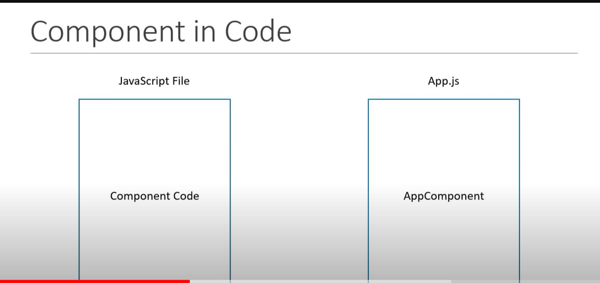

## What are components
- Components describe a part of the user interface.
- They are reusable and can be nested inside other components.
- Two Types - 
stateless Functional Components
stateful Class Components

