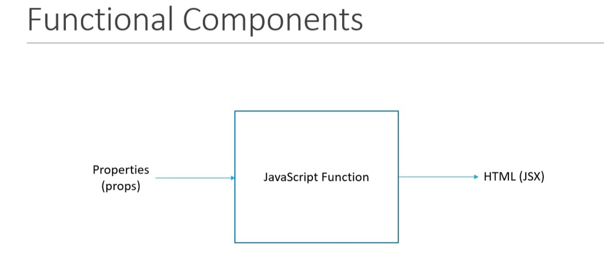

# Functional Components

### Functional Components are just  `javascript functions`.

### They can optionally receive an object of properties as `props`.

### They return  `HTML JSX` which describes the UI.
